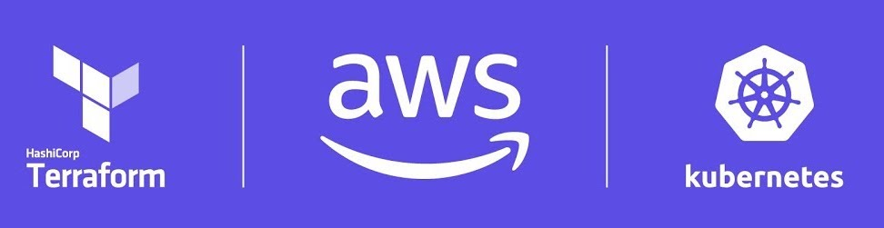

# Quest AWS Infra
This repository contains the Terraform code that's used to provision infrastructure that hosts the Quest node application.



```
├── eks-quest-cluster-dev-00
│   ├── bootstrap
│   └── eks-core
├── networking
└── s3-backend
```

## Inventory
| Name | Description |
|---|---|
| [eks-core](./eks-quest-cluster-dev-00/eks-core/README.md) | Deploys EKS and Node Groups |
| [core-bootstrap](./eks-quest-cluster-dev-00/core-bootstrap/README.md) | Bootstraps the cluster with ArgoCD and IRSA config |
| [network](./network/README.md) | Route53 DNS zone and VPC |
| [s3-backend](./s3-backend/README.md) | S3 Terraform backend bucket |